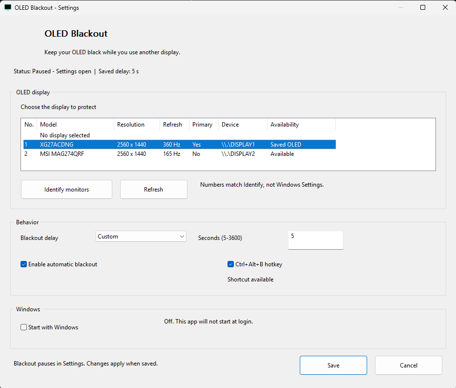

# OLED Blackout

[](https://github.com/kerem02/oled-monitor-blackout/actions/workflows/build.yml)
[](https://github.com/kerem02/oled-monitor-blackout/releases/latest)

OLED Blackout is a lightweight, native Windows tray utility for protecting an OLED in a multi-monitor setup. When the pointer leaves the selected display for the configured delay, the app covers that display with solid black. Returning the pointer removes the blackout on the next fast poll.

The display remains connected, so Windows does not rearrange your desktop. The app does not change monitor power, resolution, HDR or display topology.



## Highlights

- Blackout applies only to the explicitly selected display.
- Stable device-path identity is used instead of a fragile monitor number.
- Hotplug, display changes, DPI changes, sleep/wake and missing-display recovery fail open.
- 5–3600 second delay, plus 10/30/60/120 second presets.
- Optional `Ctrl+Alt+B` toggle using the standard `RegisterHotKey` API.
- Native tray and Settings UI, monitor identification and per-user Windows startup.
- No administrator access, installer, AutoHotkey, .NET runtime, telemetry or network connection.
- Portable x64 executable built with C++17 and documented Win32 APIs.

## Download and run

1. Open [Releases](https://github.com/kerem02/oled-monitor-blackout/releases/latest).
2. Download `OLED-Blackout-2.1.0-win-x64.zip` and extract it to a permanent folder.
3. Run `OLEDBlackout.exe`.
4. In Settings, use **Identify monitors**, select the OLED, choose a delay and click **Save**.

The app starts in the notification area. Right-click its icon for Enable/Disable, delay, monitor selection, Settings and Exit. Launching the EXE a second time opens the existing instance's Settings window.

The release is currently unsigned, so Windows SmartScreen may show an unknown-publisher warning. Verify the ZIP checksum published beside the release. Do not download repackaged binaries from third-party sites.

## Behavior and safety

The blackout window is borderless, topmost, non-activating, omitted from Alt+Tab/taskbar and mouse-pass-through. It covers the selected monitor's full bounds, including negative desktop coordinates and the taskbar area. Automatic blackout pauses while Settings, a tray menu or monitor identification is open.

If the selected display disappears, becomes ambiguous, is mirrored, overlaps another desktop region, or cannot be identified exactly, blackout stops. The app never guesses another target monitor.

OLED Blackout only manages its own windows and reads normal cursor/display state. It does not:

- inject DLLs or hook graphics/input APIs;
- inspect, open or modify game processes;
- simulate mouse or keyboard input;
- install drivers or kernel components;
- use obfuscation, executable packers or network services.

This non-invasive design reduces unnecessary compatibility risk, but no universal anti-cheat guarantee is possible. Third-party anti-cheat decisions are outside the project's control. Test the application with the specific games and anti-cheat versions you use.

## Settings and privacy

Settings and bounded logs are stored in `%LocalAppData%\OLED Blackout\`:

- `settings.ini` — versioned UTF-8 settings written with atomic replacement;
- `settings.recovered.ini` — recovery copy when a malformed/unsupported file can be preserved;
- `app.log` and `app.previous.log` — approximately 256 KiB each.

There is no telemetry, analytics, updater or remote service. Continuous pointer coordinates and full display device paths are not logged.

**Start with Windows** uses only the current user's `HKCU\Software\Microsoft\Windows\CurrentVersion\Run` entry and does not require elevation. Disable startup in Settings before moving the executable; then re-enable it from the new location.

## Validation

The 2.1.0 pre-release package passed these native Windows checks on 2026-09-16:

- 96,613 core assertions;
- 48 Windows platform assertions;
- dual-monitor launch, display discovery/selection and functional blackout smoke test.

GitHub Actions builds and executes both test suites again from the tagged source before publishing a release. Portable Linux tests also run with AddressSanitizer and UndefinedBehaviorSanitizer. See [validation details](docs/VALIDATION.md) and the still-open [manual QA matrix](docs/MANUAL-QA.md). These results do not claim certification for every monitor, GPU, DPI layout or game.

## Build from source

Install Visual Studio 2022 Build Tools with **Desktop development with C++**, a Windows SDK and CMake 3.20 or newer. In a Developer PowerShell:

```powershell
cmake -S . -B build -A x64
cmake --build build --config Release --parallel
ctest --test-dir build -C Release --output-on-failure
cmake --install build --config Release --prefix dist
```

Or run `scripts/build-release.ps1` to test and create the same minimal ZIP layout under `release/`.

Portable core tests can also run on Linux:

```sh
cmake -S . -B build-linux -G Ninja -DCMAKE_BUILD_TYPE=Release
cmake --build build-linux
ctest --test-dir build-linux --output-on-failure
```

The codebase is split into portable state/geometry/configuration logic, checked Win32 platform integration, a single-threaded UI/controller, and native Settings. See [architecture](docs/ARCHITECTURE.md).

## Known limitations

- Windows 10 version 1703 or newer, or Windows 11, x64 is required.
- Extended desktop mode is required; mirrored/ambiguous targets are intentionally rejected.
- A device path is more stable than a display index but is not a universal physical serial. Reconfirm selection after changing ports, docks or display drivers.
- Exclusive fullscreen on the selected OLED, secure desktops and other topmost windows can appear above an ordinary topmost blackout window.
- HDR/GPU/display processing may affect physical black output even though the window uses RGB zero.
- On a single-monitor desktop the pointer cannot normally leave the selected display, so automatic blackout does not start.

OLED Blackout supplements, but does not replace, the panel manufacturer's built-in OLED protection and is not a burn-in guarantee.

## License

[MIT](LICENSE), copyright © 2026 Kerem Albayrak.
